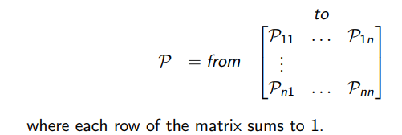
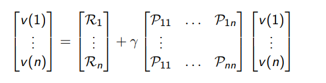
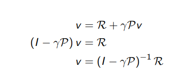
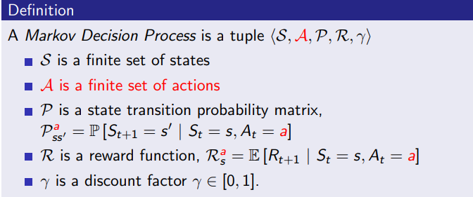
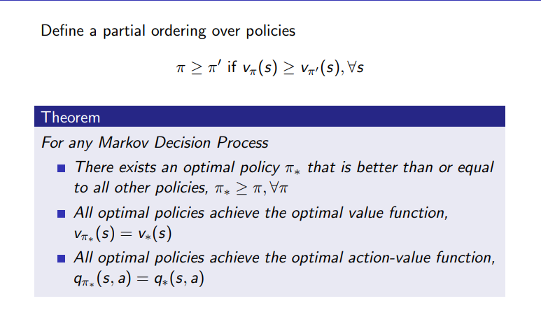
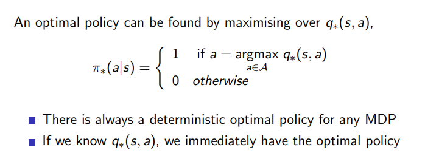
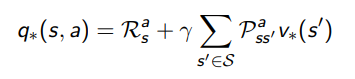

# MDPS

## Markov Processes

MDP's formally describe an environment for RL, environment is fully observable and current state characterizes process

Almost all RL problems can be formalised as MDPs

### Markov Property

P[St+1 | St
    ] = P[ St+1 | S1, ... , St ]

> The future is independent of the past given the present

### State Transition Probability and Matrix

tells the probability of transitioning from one state to next state

current state characterizes everything 

Pss' = P[ St+1 = s' | St = s ]

state transition matrix defines probabilities of transitions from state s to successor states s'

> each row tells probabilities from one starting state to any other state in the column

### Markov Process/Chain

sequence of random states S1, S2, ... with markov property

> Defn : Tuple (S,P)
>
> S -> finite set of states
>
> P -> state transition probability matrix

## Markov Reward Process

MRP is a Markov chain with value (judgements in form of rewards)

> Defn : Tuple (S,P,R,γ)
>
> S -> finite set of states
>
> P -> state transition probability matrix
>
> R -> reward function, Rs = E [Rt+1| St = s ]
>
> γ -> discount factor ∈ [0, 1]

start in state s at time t, at time t+1  reward recieved

what we mainly care abt is the overall reward that certain sequence gets(maximize it)

### Return

Gt is total discounted reward from time step _t_ onwards

    Gt = Rt+1 + &gamma; Rt+2 + &hellip; = &sum;k=0&infin; &gamma;k Rt+k+1

γ closer to 0: near sightedness (cares more about short term reward)

γ closer to 1: far sightedness (cares more about long term/delayed reward)

> why discount:
>
> mathematically convenient, prevents infinite returns in cyclic processes

### Value Function

total reward/ expected return starting from state _s_

> Defn : state value function v(_s_) of MRP is expected return starting from state _s_
>
> v(_s_) = E [Gt | St = _s_]

### Bellman Equation 

v(s) = E [Rt+1 +  γ * v(St+1)| St = _s_]

expected/immediate reward now + discounted value at next state

can be expressed better using matrices and vectors

immediate reward + gamma * transition matrix * value of state ended up in

every state has one entry

eqn is linear, can be solved directly but only possible for small MRPs

## Markov Decision Process

an MRP with decisions (can take actions)

### Policy

distribution over actions given states, defines behavior of agent

π(a|s) = P [At = a | St = s]

policy is the same, independent of time step in, only depends on current state (called stationary policy)

### Value Function

- state value function: vπ (_s_)

    expected total return starting from state _s_, given that policy π is followed

- action value function: qπ (_s_, _a_)

    expected total return starting from state _s_, following policy π after taking action _a_

### Optimal Value Function

best possible performance in MDP

- optimal state-value function v∗(s) -> maximum state-value function over all policies

    v∗(s) = max v∗(s)

- optimal action-value function v∗(s) -> maximum action-value function over all policies

    q∗(s,a) = max q∗(s,a)

MDP can be considered to be solved when we know q∗(s,a)  (basically the optimal value function)

### Optimal Policy

a certain policy is better than another policy if over all states, that certain policy's value function is greater

### Bellman Optimality Equation

>for v∗ :

finds all q* values and chooses the max out of them 

v∗(s) = max q∗(s, a)

>for q∗ :

since this is non linear, cant use matrix and stuff to solve it, need to use iterative methods like q-learning, value iteration, policy iteration, sarsa