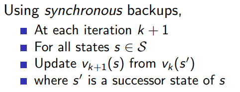
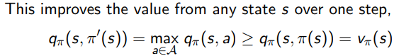
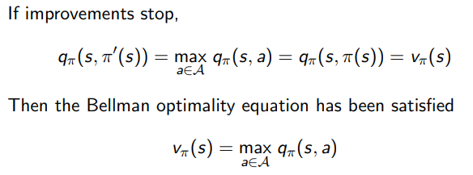

# Planning by Dynamic Programming

## Dynamic Programming

dynamic - problems have some sequential/step by step component

programming - optimization of program (for rl it could be policy)

how it solves complex problems - breaks into subproblems, solve those and combine their solutions

DP is a general soln method for problems that have

- Optimal Substructure

    - Principle of optimality 

        can be decomposed into subproblems
        
        problem can be solved by breaking down into pieces, solve for those pieces' optimal solution, and those solns help solve main problem

- Overlapping Subproblems

    those pieces into which we breakdown the problem into recur many times, solutions to them can be reused

> bellman eqn satisfies both properties (therefore MDPs also satisfy)
>
> value function -> similar to 2nd point, stores and reuses solution

planning - full knowledge of MDP available

1. prediction - given the MDP and the policy, gives a value function (policy evaluation) (uses bellman expectation eqn)

2. control - given MDP, need to find out optimal value function (best/optimal policy) (uses bellman optimality eqn)

## Policy Evaluation

(policy given, evaluate that policy)

start off with some random value function, and then apply bellman expectation (1 step look ahead), iteratively if we go on doing this we will end up with the actual value function

updates all states (**synchronous backups**)

to find value function for next state _s_:

use that 1 step look ahead to see what all possible actions and their possible states are there, and use the current value functions for their states along with the probabilities to find the updated value func for that single state

vk+1 = Rπ + γPπ vk

## Policy Iteration

first evaluate policy using above stuff, and then make the policy better  by acting greedily wrt vπ

for small problems single iteration is mostly enough, bigger problems will require more iterations of evaluation and improvement

this process will always lead us to π∗

if value function found after some iteration is better than value func found before, then policy can be said to be improved

when current val func = prev val func, it will satisfy the bellman optimality and current val func/policy is optimal, MDP has been solved

- not necessary need to repeat iterations till convergence, after certain no of iterations it is possible to reach optimal policy

- if no of iterations = 1, called **value iteration**

> Principle of Optimailty
>
> A policy π(a|s) achieves the optimal value from state s, vπ(s) = v∗(s), iff
>
>For any state s' reachable from s, π achives optimal value from state s', vπ(s') = v∗(s')

## Value Iteration

to find optimal policy, iterative application of Bellman optimality

any middle step value func doesnt correspond necessarily to a policy

converges to optimal value func in the end