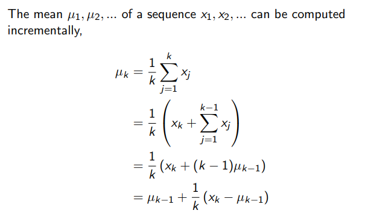
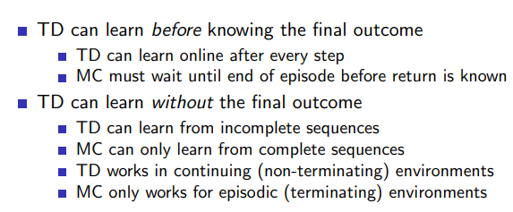

# Model Free Prediction

## Monte Carlo Learning

- learn directly from complete episodes 

    - episodes must terminate

- value = mean return

goal is to learn vπ from episodes of exp under policy π

MC policy evaluation uses empirical mean return in place of expected return (no expectation cuz unknown environment)

### First visit MC policy evaluation

first timestep _t_ that state _s_ is visited in an episode,

- increment counter N(s) <- N(s) + 1

- increment total return S(s) <- S(s) + Gt

value estimated by mean return, cuz of law of large numbers as N(s) becomes bigger V(s) will be closer to vπ (s)

### Every visit MC policy evaluation

diff bewtn every visit MC and first visit MC is that in every visit, we increment the counter and total return every time step _t_ that state _s_ is visited in an episode, in first visit it is only the first time step

### Incremental MC

Incremental Mean :

(the xk - uk -1 acts like an error term)

**Updates**:

for each state St with some return Gt:

- update visit count

- update mean with error betwn value function and actual return

V(St) + (Gt − V(St)) * 1 / N(St) 

> to forget older episodes:
>
> non stationary probs (mdp changes)
>
> constant step size, exponential moving average, 1/N replaced by some constant size, not correcting the mean perfectly more like over or under correcting

## Temporal Difference Learning

- learn directly from episodes of exp

- model free

- in mc complete eps were reqd, but in td learning can occur from incomplete eps (_bootstrapping_), can estimate/guess 

_Goal_ : learn vπ

MC -> update value func slightly in direction of error betwn actual return and value func

TD -> update value func towards estimated return after 1 step (estimated return : immediate reward + discounted value of next step)

helps reach target without having to actually perform process

(ex: car crash gon happen, but doesnt happen, MC will not regard it as bad, but TD will cuz it is making guesses of sorts and can predict that that was dangerous situation)

td target - that estimated return 

Rt+1 + γV(St+1)

### Bias Variance Tradeoff

Gt return is unbiased estimate of value function, true td target (has actual value function) is also unbiased 

but td target is a biased estimate of value function (could behave wrongly at times)

|feature|MC|TD|
|---|---|---|
|Bias|None|Some bias|
|Variance|High|Lower|

> variance:
> 
> MC return depends on full trajectory, loads of noise 
>
> TD return depends only on one random action, much lower noise 

TD is more efficient and sensitive to initial value

MC converges to a soln with min mean-squared error (only based on what observations)

TD converges to soln of max likelihood Markov model (meaning it will give the solution to mdp that best fits the data)

TD - more efficient in Markov envs (expliots Markov prop)
MC - effective in non Markov (partial, ..)

### TD (λ)

n -> some n steps into the future the TD target can look at

n = 1 -> TD
.
.
n = infinity -> MC (considering full future)

**to find best n** :
take avg over all n-step λ values, for 1 check weight of 1-λ is multiplied 

λ -> ∈ [0, 1] (0 means TD(0), 1 means MC)
